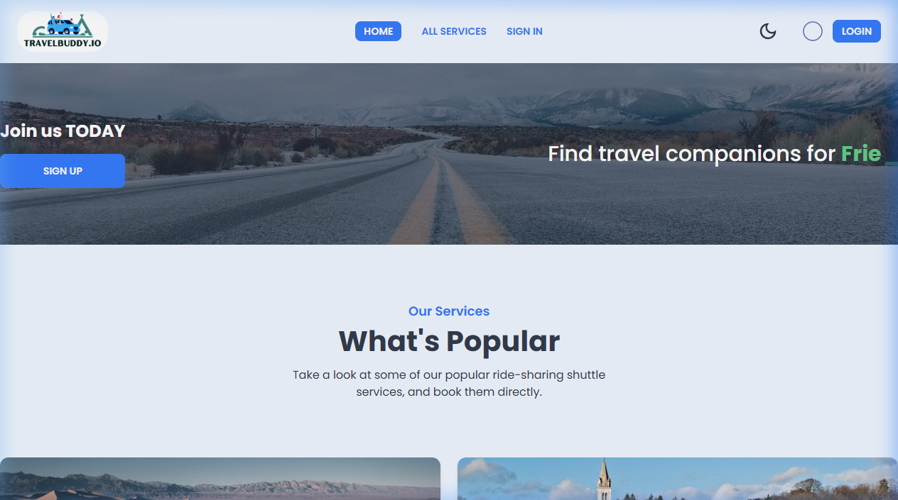

# 🚗 TravelBuddy.io

> A responsive single-page React application for booking, providing, and exploring carpool and ride-sharing services. Includes a personalized dashboard for users to manage their own services and booking schedules securely.

<p align="center">
  <a href="https://travel-buddy-io.web.app/" target="_blank">
    
  </a>&nbsp;
  <a href="https://github.com/Rezwan66/travel-buddy-io-server" target="_blank">
    
  </a>
</p>

---

## 📸 Preview

<p align="center">
  
</p>

---

## ✨ Key Features

- 🗺️ **Discover Services** — Browse a wide range of popular and available ride-sharing and shuttle services directly from the homepage.
- 🔍 **Search & Explore** — Access the "All Services" page to view everything, search for specific services by name, or view detailed information.
- 🔒 **Protected Booking System** — Secure service booking available exclusively to authenticated users.
- 👨‍💻 **Personalized Dashboard** — A dedicated space for logged-in users to manage their activities:
  - **Add Services:** Post your own ride-sharing services for others to book.
  - **Manage Services:** Edit details of your posted services or remove them from the platform.
  - **My Schedules:** Track both your bookings of other people's services, and other people's bookings of your services. Easily update booking statuses (Pending, In Progress, Completed).
- 🔐 **Secure Authentication** — User login and registration powered by Firebase SDK.
- 🌗 **Dark Mode** — Built-in theme toggle for comfortable viewing in any lighting condition.
- ✨ **Interactive UI** — Smooth animations (Framer Motion) and group hover effects for an engaging user experience.

---

## 🛠️ Tech Stack

[](https://skillicons.dev)

| Layer | Technologies |
|:------|:-------------|
| **Frontend** | React 18, React Router, TanStack Query, Tailwind CSS, DaisyUI |
| **Auth** | Firebase SDK |
| **Backend** | Node.js, Express.js |
| **Database** | MongoDB |
| **UI/UX** | Framer Motion, Lottie React, SweetAlert2, React Icons |
| **Maps** | Leaflet, React Leaflet |
| **Build** | Vite |
| **Hosting** | Firebase (Client) · Vercel (Server) |

---

## 🚀 Getting Started

### Prerequisites

- Node.js (v16+)
- npm or yarn
- Firebase project with Authentication enabled

### Installation

```bash
# Clone the repository
git clone https://github.com/Rezwan66/travel-buddy-io-client.git

# Navigate to the project
cd travel-buddy-io-client

# Install dependencies
npm install
```

### Environment Variables

Create a `.env.local` file in the root directory with your Firebase configuration:

```env
VITE_apiKey=your_firebase_api_key
VITE_authDomain=your_project.firebaseapp.com
VITE_projectId=your_project_id
VITE_storageBucket=your_project.appspot.com
VITE_messagingSenderId=your_sender_id
VITE_appId=your_app_id
```

### Run Locally

```bash
npm run dev
```

The app will be available at `http://localhost:5173`

---

## 📁 Project Structure

```
src/
├── assets/          # Static assets (images, animations)
├── components/      # Reusable UI components
├── firebase/        # Firebase configuration
├── hooks/           # Custom React hooks
├── pages/           # Route-level page components
├── providers/       # Context providers (Auth, Theme)
├── routes/          # Route definitions & protected routes
└── utilities/       # Helper functions
```

---

## 🔗 Related

- **Server Repository:** [travel-buddy-io-server](https://github.com/Rezwan66/travel-buddy-io-server)
- **Live Site:** [travel-buddy-io.web.app](https://travel-buddy-io.web.app/)
